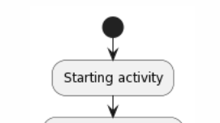
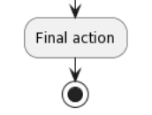

# annoscheme
Annotation scheme for code-diagram mapping in Java language. This repository serves as an aggregator project for experimenting with this solution and is not a final release - thus why versioning is static and artefacts need to be rebuild in case of any change. 
If any bugs or errors occurr, feel free to leave a ticket or write me a PM. 

The solution works both in build time ([Maven](https://maven.apache.org/)) and runtime using AspectJ pointcut language (find out more [here](https://www.eclipse.org/aspectj/)).

## Content
* Spring integration template - `spring-integration-template` 
* Spring integration example application - `spring-integration`
* Java example - `master`

## Requirements
* Java 8 ([JDK 1.8.0-2**](https://www.oracle.com/java/technologies/downloads/)) or higher
* [Maven 3.6.0](https://maven.apache.org/download.cgi) or higher
* Any shell (```zsh```, ```bash```...)
* IDE of your choice (prefferably IntelliJ IDEA)
* Target application with Maven-defined POM for linking to this solution

## Installation
* Clone this repository 
* Insert your source files of the designated applications into the `application` module
* Fill in the missing POM properties within *application* and *main* modules
    * You might use your own POM file, however a sample POM which is recommended and with instruction comments is included
    * For both Java applications or Java & Spring applications, fill in the missing properties within POM files 
* Define property strings within `/properties/annotationvalue.properties` to be used with the target annotations

After these steps, the build setup should be ready and the whole project can be built from the root folder using ```clean install``` maven goals. 
The generated diagram images are created using PlantUml text-to-diagram  library and are stored in `/img/` folder.  

## Using annotations
Every annotation serves as a placeholder for a real element within UML Activity diagram (UML AD). Individual element types are defined using `ActionType` parameter of each annotation, however an activity within the diagram doesn't need to be specified (`ActionType.ACTION`) as it is a default value for the action type of each [@Action annotation](#annotation-types).

ActionType enum values:
* `ACTION` - default value, indicates Activity element
* `START` - annotates the first action right after the Start element of Activity diagram 
* `END` - annotates the last action(s) of the diagram - End AD element is appended after the annotated element
* `CONDITIONAL` - annotates the first element of each branch after an AD conditional element (currently only two conditional branches are supported)

### Annotation types
Currently, these annotations are supported:
* `@Action` - standard activity within UML Activity.
    * actionType: `ActionType` enum value = (optional if element should be Activity)
    * message: `String` = (optional) message displayed within the activity element
    * parentMessage: `String` = (optional if `ActionType.START`) parent message of the annotated element
    * diagramIdentifiers: `String[]` = (required) identifiers of diagrams in which the annotated element is placed
* `@Conditional` - present with `@Action` if the annotated element is the first in the conditional branch
    * type: `BranchingType` enum value = (required) indicating the main or alternative (positive or negative outcome of the condition) element of each conditional branch after AD conditional element
        * `BranchingType.MAIN` = "positive" outcome branch root
        * `BrachingType.ALTERNATIVE` = "negative" outcome branch root
    * condition: `String` = (required) label of the conditional element - must be the same in both `MAIN` and `ALTERNATIVE` branches
    * diagramIdentifiers: `String[]` = (required) diagram identifiers of diagrams in which the conditional element is located 
* `@Joining` - present with `@Action` if annotated element is the joining point of the two conditional element branches
    * condition: `String` = condition label of the `@Conditional` element for which the element serves as a join point
    * diagramIdentifiers: `String[]` = identifiers of diagrams in which element is located

You can find usages of these annotations in the [Usages](#Usages) section along with expected output.

## Usages
Examples with each supported annotation/element are listed along with annotation value representing the displayed element.
Parameter strings are already resolved in the examples for clarity, but in real use scenario you should be using defined parameter strings within `/properties/annotationvalue.properties`:

```
# Sample usage for annotationvalue.properties 
diagram1.id=Diagram 1
diagram1.start=Start message for Diagram 1
diagram1.someAction=Activity label 1
diagram1.someOtherAction=Activity label 2 
diagram2.end=End message for Diagram 1
# ...
```

Annotations can annotate either method or constructors. These serve as a placeholder for an element within the AD, and in runtime these annotations are used within a *pointcut* defined in AspectJ to intercept objects returned from these methods.
  * Objects are generated from the top-level class members
  * After each return value is intercepted, the diagram is re-generated with the added object element
  * Some object elements might appear **after** the processing of lower-level method executions due to AOP interception chain


### Start element
```{java}
	@Action(actionType = ActionType.START,
        message="Starting activity", diagramIdentifiers = {"Example ID"})
```


### End element
```{java}
	@Action(actionType = ActionType.END,
        message="Final action", diagramIdentifiers = {"Example ID"})
```


### Conditional element

```{java}
	// positive outcome (main) branch
    @Conditional(branchingType = BranchingType.MAIN,
      condition="Condition fulfilled?", diagramIdentifiers={"Example ID"})
    @Action(actionType = ActionType.ACTION,
        message="Main branch root", diagramIdentifiers = {"Example ID"})

    //negative outcome (alternative) branch
    @Conditional(branchingType = BranchingType.ALTERNATIVE,
      condition="Condition fulfilled?", diagramIdentifiers={"Example ID"})
    @Action(actionType = ActionType.ACTION,
        message="Alternative branch root", diagramIdentifiers = {"Example ID"})

```


### Joining element

```{java}
    @Joining(condition = "Condition fulfilled?",
        diagramIdentifiers = {"Example ID"})
    @Action(actionType = ActionType.ACTION,
        message="Main branch root", diagramIdentifiers = {"Example ID"})

```    

